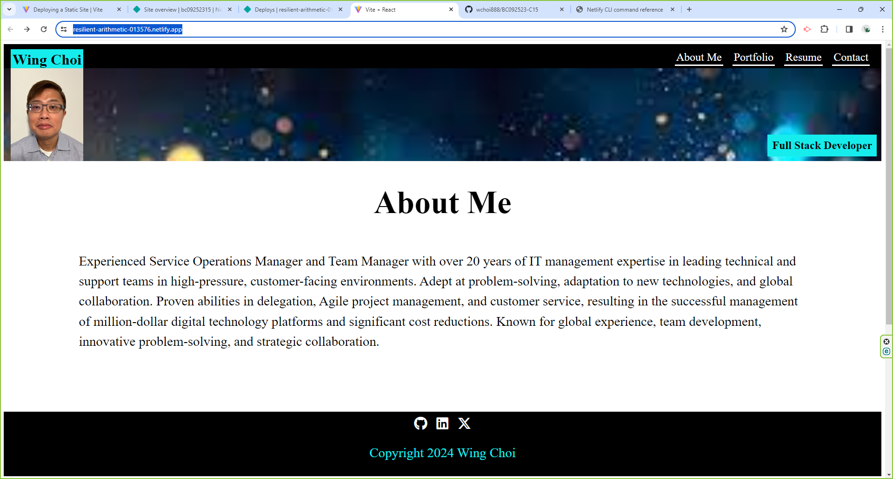

# React Portfolio

## Description

The React Portfolio project is a modern and dynamic single-page application designed to showcase the skills, projects, and expertise of web developers. Built using React, this portfolio provides a sleek and interactive user experience, enabling potential employers, clients, and collaborators to explore the developer's work samples with ease. With sections dedicated to presenting personal information, project portfolios, contact details, and professional proficiencies, this portfolio serves as a comprehensive representation of the developer's capabilities. The intuitive navigation allows users to seamlessly browse through different sections, including About Me, Portfolio, Contact, and Resume, ensuring a smooth and engaging experience. Employers can quickly assess the developer's suitability for a position, while collaborators can explore past projects and skills. With its modern design and seamless functionality, the React Portfolio project sets developers apart in a competitive market, showcasing their proficiency with the latest web development technologies and frameworks.

## Table of Content

- [Installation](#installation)
- [Usage](#usage)
- [Contributing](#contributing)
- [License](#license)
- [Testing](#testing)
- [Questions](#questions)
- [Deploy_URL](#Deploy_URL)
- [Screenshot](#Screenshot)

## Installation

To install React Portfolio, make sure you run “git clone git@github.com:wchoi888/BC092523-C15.git” on your machine. Change directory to “Project Portfolio”. Once there, run the following command to install the required dependencies: npm install.

## Usage

After installing the dependencies, you can npm run start, to launch the application.

## Contributing

Contributing to React Portfolio is welcome! If you'd like to enhance the functionalities or fix issues, please follow these steps: 1) Fork the repository 2) Create a new branch for your feature or bug fix 3) Make your changes and commit them 4) Push your changes to your fork 5) Open a pull request to the main branch.

## License

[MIT License](https://opensource.org/licenses/MIT)

## Testing

React Portfolio Application does not have automated tests, but you can manually test its functionality by following these steps: 1) Ensure that the application is installed and dependencies are installed correctly. 2) Run the application using “npm run start”. 3) Verify that the application behaves as expected and performs the desired operations.

## Questions

[github profile](https://github.com/wchoi888)

Please contact me on this email wchoi@rocketmail.com

## Deploy_URL

https://resilient-arithmetic-013576.netlify.app/

## Screenshot

